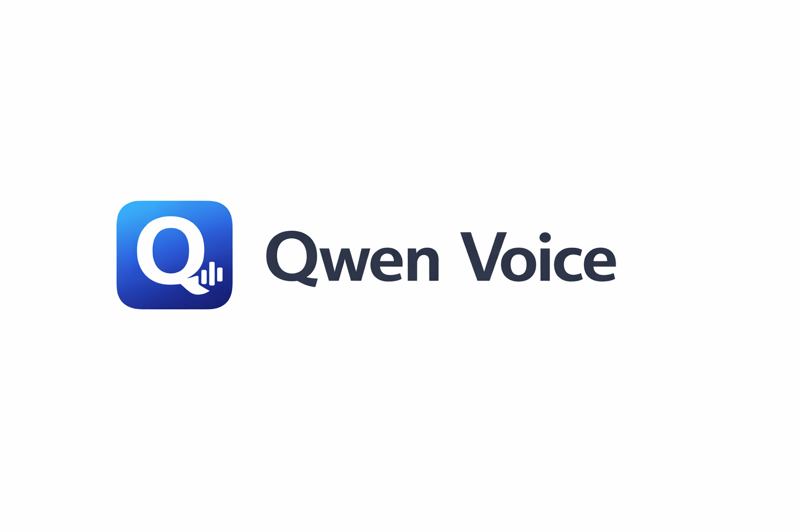
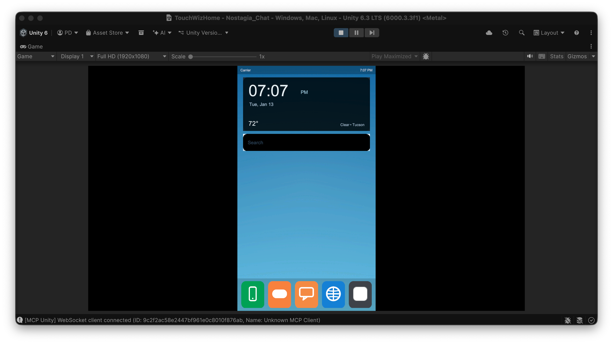
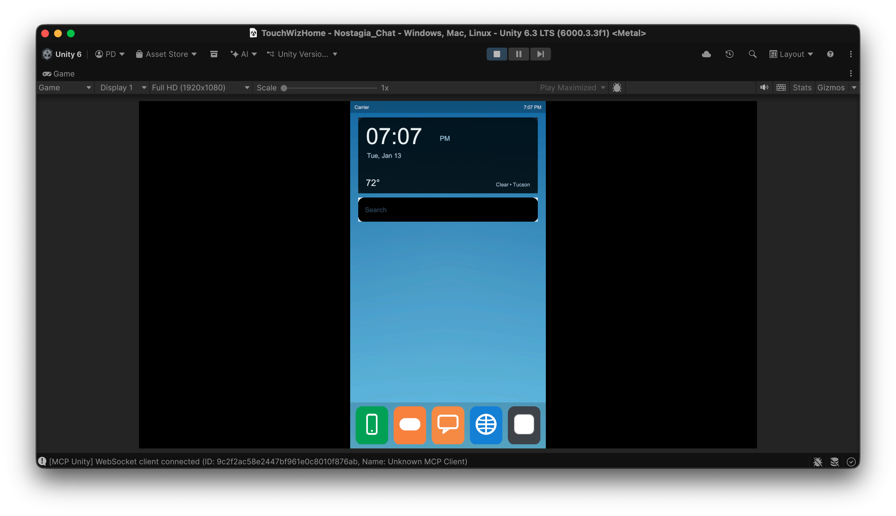

<div align="center">
  

# Qwen Voice

**Native macOS app for Qwen3-TTS on Apple Silicon**


</div>

## Overview

Qwen Voice brings state-of-the-art text-to-speech to your Mac with three generation modes in a native SwiftUI interface. No Python install, no terminal, no dependencies — just download and run.

Built on [qwen3-tts-apple-silicon](https://github.com/kapi2800/qwen3-tts-apple-silicon) by [@kapi2800](https://github.com/kapi2800).

## Screenshots

<div align="center">
  
  
</div>

## Features

### 🎙️ Custom Voice
Generate speech with preset speakers across 4 languages (English, Chinese, Japanese, Korean). Control emotion and delivery with natural language instructions, and adjust speed.

### ✨ Voice Design
Describe the voice you want in natural language — age, gender, accent, tone — and generate speech with it.

### 🎭 Voice Cloning
Clone a voice from a short audio sample (WAV/MP3/AIFF). Save cloned voices for reuse across sessions.

### 🚀 More
- **Model Manager** — download and manage models directly from HuggingFace in-app
- **Generation History** — searchable SQLite-backed log with instant playback
- **Batch Generation** — generate multiple utterances at once
- **Keyboard Shortcuts** — `Cmd+Return` generate, `Space` play/pause, `Cmd+Shift+O` open output folder

## Requirements

| Requirement | Detail |
|-------------|--------|
| macOS | 14.0+ (Sonoma) |
| Chip | Apple Silicon (M1 / M2 / M3 / M4) |
| RAM | 4–8 GB free depending on model |

## Install

1. Download **QwenVoice.dmg** from [Releases](https://github.com/PowerBeef/QwenVoice/releases)
2. Drag to `/Applications`
3. Remove the quarantine attribute (the app is unsigned):
   ```bash
   xattr -cr "/Applications/Qwen Voice.app"
   ```
4. Open the app → go to the **Models** tab → download a model → start generating

## Models

| Model | Mode | Tier | HuggingFace Repo |
|-------|------|------|------------------|
| Custom Voice | Custom Voice | Pro 1.7B | `mlx-community/Qwen3-TTS-12Hz-1.7B-CustomVoice-8bit` |
| Voice Design | Voice Design | Pro 1.7B | `mlx-community/Qwen3-TTS-12Hz-1.7B-VoiceDesign-8bit` |
| Voice Cloning | Voice Cloning | Pro 1.7B | `mlx-community/Qwen3-TTS-12Hz-1.7B-Base-8bit` |
| Custom Voice | Custom Voice | Lite 0.6B | `mlx-community/Qwen3-TTS-12Hz-0.6B-CustomVoice-8bit` |
| Voice Cloning | Voice Cloning | Lite 0.6B | `mlx-community/Qwen3-TTS-12Hz-0.6B-Base-8bit` |

Pro models produce higher quality output. Lite models are faster and use less memory.

## Building from Source

**Prerequisites:** Xcode 15+, [XcodeGen](https://github.com/yonaskolb/XcodeGen), macOS 14+

```bash
git clone https://github.com/PowerBeef/QwenVoice.git
cd QwenVoice/QwenVoice
xcodegen generate
open QwenVoice.xcodeproj
```

Build and run from Xcode. On first launch in dev mode, the app auto-creates a Python venv at `~/Library/Application Support/QwenVoice/python/` and installs dependencies.

**Release build:**

```bash
./scripts/release.sh
```

This bundles Python 3.13 + ffmpeg into the app, builds with `xcodebuild`, and creates a DMG at `build/QwenVoice.dmg`.

## Architecture

Two-process design:

- **SwiftUI frontend** — UI, model management, generation history (SQLite via GRDB)
- **Python backend** — MLX-based inference via `server.py`, communicating over JSON-RPC 2.0 on stdin/stdout

The release build bundles a standalone Python 3.13 (arm64) and ffmpeg so no system dependencies are required. Only one model is loaded into GPU memory at a time.

## Credits

- [qwen3-tts-apple-silicon](https://github.com/kapi2800/qwen3-tts-apple-silicon) by [@kapi2800](https://github.com/kapi2800) — MLX-based inference backend
- [Qwen3-TTS](https://huggingface.co/Qwen) by Alibaba/Qwen team — the underlying model family