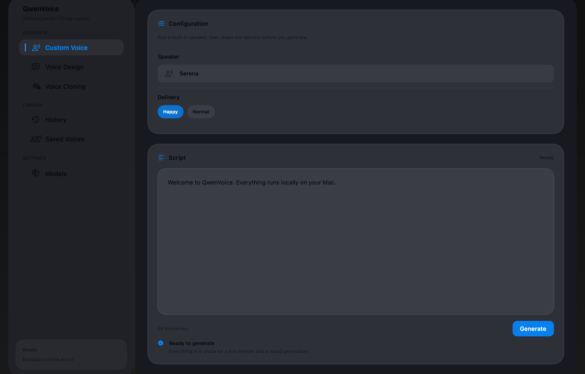
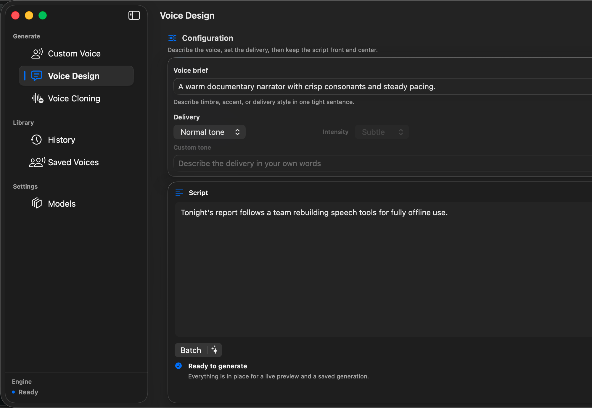
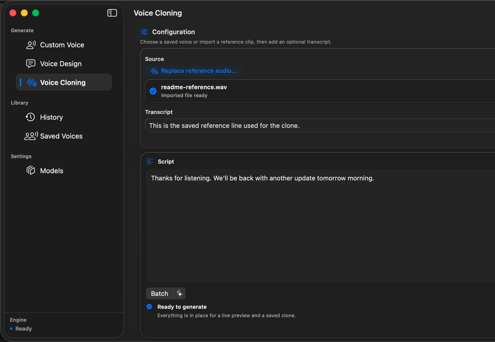

## Screenshots

### Custom Voice



### Voice Design



### Voice Cloning



## Overview

QwenVoice is a native macOS app for Qwen3-TTS with custom voices, voice design, and voice cloning, 100% offline on Apple Silicon.

It uses a SwiftUI frontend plus a long-lived Python backend that runs MLX inference locally. End users do not need to install Python or use the terminal when running the packaged app.

## Shipped Modes

### Custom Voice

Generate speech with the app’s built-in English speakers:

- Ryan
- Aiden
- Serena
- Vivian

### Voice Design

Voice Design is a standalone destination. Describe the voice you want, then shape tone before generating.

### Voice Cloning

Clone a voice from a short reference clip. The app accepts WAV, MP3, AIFF, M4A, FLAC, OGG, and WebM input and can also use an optional transcript for better cloning accuracy.

## What the App Does Not Expose

- no temperature or max-token controls
- no streaming batch UI

Single-generation flows in the shipping GUI use live streaming preview and sidebar playback. Batch generation remains sequential and final-file-based.

The backend still supports additional benchmark/internal advanced sampling parameters beyond what the shipped GUI exposes.

For normal app behavior, the backend cache policy defaults to `adaptive`. `QWENVOICE_CACHE_POLICY=always` remains available as a conservative diagnostic override for backend benchmarking and regression checks.

## Features

- Native model downloads from Hugging Face
- Live streaming preview for single generations
- Local generation history stored in SQLite via GRDB
- Batch generation for multi-line jobs
- Sidebar waveform playback UI
- Configurable output directory and autoplay preference

## Requirements

| Requirement | Detail |
|---|---|
| macOS | 15.0+ |
| Chip | Apple Silicon |
| RAM | 8 GB+ recommended |

## Install from GitHub Releases

Download the appropriate DMG from [Releases](https://github.com/PowerBeef/QwenVoice/releases).

Current GitHub release builds are produced by the dual-release workflow and typically appear as:

- `QwenVoice-macos26.dmg` — modern liquid UI build
- `QwenVoice-macos15.dmg` — legacy glass UI build

Those workflow-built DMGs are the release source of truth. Local `./scripts/release.sh` output is useful for debug validation, but it is not authoritative shipped-release proof.

Then:

1. Drag `QwenVoice.app` to `/Applications`
2. Open the app normally. Official GitHub workflow releases are signed, notarized, and stapled.
3. macOS may still show the standard first-open “downloaded from the Internet” confirmation prompt.
4. Go to **Models**, download a model, and generate speech

If you are testing an older unsigned build or an unofficial local/debug artifact, you may still need to remove quarantine manually:
   ```sh
   xattr -cr "/Applications/QwenVoice.app"
   ```

## Models

Static model metadata comes from [`Sources/Resources/qwenvoice_contract.json`](Sources/Resources/qwenvoice_contract.json).

| Mode | Model Folder | Hugging Face Repo |
|---|---|---|
| Custom Voice | `Qwen3-TTS-12Hz-1.7B-CustomVoice-8bit` | [mlx-community/Qwen3-TTS-12Hz-1.7B-CustomVoice-8bit](https://huggingface.co/mlx-community/Qwen3-TTS-12Hz-1.7B-CustomVoice-8bit) |
| Voice Design | `Qwen3-TTS-12Hz-1.7B-VoiceDesign-8bit` | [mlx-community/Qwen3-TTS-12Hz-1.7B-VoiceDesign-8bit](https://huggingface.co/mlx-community/Qwen3-TTS-12Hz-1.7B-VoiceDesign-8bit) |
| Voice Cloning | `Qwen3-TTS-12Hz-1.7B-Base-8bit` | [mlx-community/Qwen3-TTS-12Hz-1.7B-Base-8bit](https://huggingface.co/mlx-community/Qwen3-TTS-12Hz-1.7B-Base-8bit) |

## Building from Source

Source-build prerequisites:

- macOS 15+
- Apple Silicon
- Xcode 26+ for the default `QW_UI_LIQUID` checkout
- XcodeGen

```sh
git clone https://github.com/PowerBeef/QwenVoice.git
cd QwenVoice
./scripts/regenerate_project.sh
open QwenVoice.xcodeproj
```

Build the `QwenVoice` scheme from Xcode, or use:

```sh
xcodebuild -project QwenVoice.xcodeproj -scheme QwenVoice build
```

The checked-in `project.yml` defaults to `QW_UI_LIQUID`, so a local build of the default checkout needs a macOS 26 SDK. CI still validates the macOS 15 legacy profile by patching `project.yml` through `scripts/set_ci_ui_profile.sh` before regenerating the project.

Useful local checks:

```sh
./scripts/check_project_inputs.sh
python3 scripts/harness.py validate
python3 scripts/harness.py test --layer swift
python3 scripts/harness.py test --layer server
python3 scripts/harness.py test --layer contract
python3 scripts/harness.py test --layer ui
```

### Development-mode Python behavior

In a clean source checkout, `Sources/Resources/python/` is usually absent. The app then creates a venv under `~/Library/Application Support/QwenVoice/python/` on first launch and installs the backend dependencies from `Sources/Resources/requirements.txt`.

Have a local Python 3.11-3.14 install available first. A typical setup is:

```sh
brew install python@3.13
```

### Local release packaging

For a local release build and DMG:

```sh
./scripts/release.sh
```

That script bundles Python and ffmpeg, builds the Release app, verifies the bundle, and by default produces `build/QwenVoice.dmg`.

Use GitHub workflow artifacts for authoritative shipped release validation.

## Tone and Emotion Control

Custom Voice and Voice Design are guided by natural-language instructions rather than SSML-style sliders or markup.

See [`qwen_tone.md`](qwen_tone.md) for the current app-oriented guidance on:

- what the shipped app exposes
- what broader Qwen3-TTS ecosystem notes are informational only

## Architecture

QwenVoice uses a two-process architecture:

- **SwiftUI frontend** in `Sources/` for UI, downloads, persistence, and playback
- **Python backend** in `Sources/Resources/backend/server.py` for MLX inference over newline-delimited JSON-RPC 2.0

Static TTS contract data is shared by Swift and Python through `Sources/Resources/qwenvoice_contract.json`.

Default runtime output layout:

```text
~/Library/Application Support/QwenVoice/
  models/
  outputs/
    CustomVoice/
    VoiceDesign/
    Clones/
  voices/
  history.sqlite
```

## More Docs

- [`docs/README.md`](docs/README.md) — documentation index
- [`docs/reference/current-state.md`](docs/reference/current-state.md) — current repo facts
- [`docs/reference/engineering-status.md`](docs/reference/engineering-status.md) — current strengths and caveats

## Credits

QwenVoice builds on:

- [Qwen3-TTS](https://github.com/QwenLM/Qwen3-TTS)
- [mlx-audio](https://github.com/Blaizzy/mlx-audio)
- [MLX](https://github.com/ml-explore/mlx)
- [GRDB.swift](https://github.com/groue/GRDB.swift)
